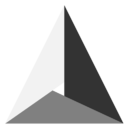
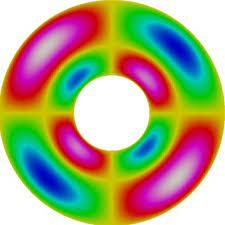
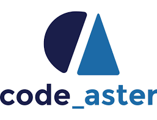

<!--
- 🔭 currently working on ...
- 🌱 currently learning ...
- 💬 Ask me about ...
- 📫 How to reach me: ...
- ⚡ Fun fact: ...
-->

  

# FTrillaudP's README

Current goal: make available some alternative open-source or free Finite Element (FE) software to a large audience of end-users and advanced-users alike through examples.

The software are:

- Geometry/mesh builder:

 
 

[Onelab](https://onelab.info/)
[Salome](https://www.salome-platform.org/)
- FE solvers:

 
 
 
 

[Elmer](http://www.elmerfem.org/blog/)
[Code_Aster](https://www.code-aster.org/spip.php?rubrique2)
[Code_Saturne](https://www.code-saturne.org/cms/web/)
[Openfoam](https://openfoam.org/)

# 🎥 Videos

 

# 🧑‍🔬 Online profiles

 
 
 
 

[Google scholar](https://scholar.google.com/citations?user=KK0VX34AAAAJ&hl=en)
[Publons](https://publons.com/wos-op/researcher/1699475/frederic-trillaud/)
[Scopus](https://www.scopus.com/authid/detail.uri?authorId=55912971200)
[ORCID](https://orcid.org/0000-0002-6964-5603)

# :fire: Statistics:

